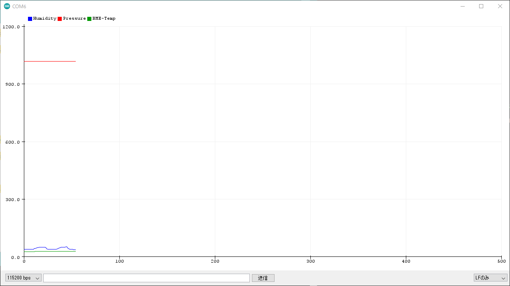
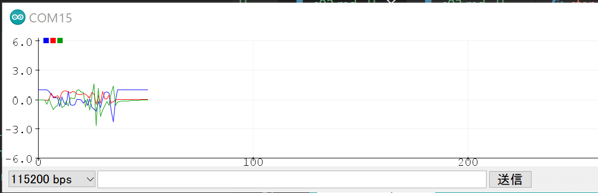

# IoT演習

Atom Liteに接続されたセンサ, Atom Matrixの内蔵センサにアクセスする． 


## Atom Matrxについて


Switch Scienceより：
    M5Stackシリーズの中で最もコンパクトな開発モジュールで、サイズはわずか24 x 24 mmです。M5StickCと比べてGPIOピンを多く持ち、小型の組み込みデバイス開発に適しています。メインコントローラとして、WI-FiとBluetooth通信を扱え4 MBの内蔵SPIフラッシュメモリを持つ、ESP32-PICO-D4チップを搭載しています。

 ### 仕様

- USB Type-C
- ESP32 PICOベース
- 4 MBフラッシュメモリ
- 2.4G SMDアンテナ：Proant 440
- MPU6886 6軸センサ
- 25 x RGB LED（WS2812C）
- 1 x 赤外線LED
- 1 x プログラム可能なボタン
- 1 x リセットボタン
- 6 x GPIOピン
- Grove互換インターフェース
- プログラムプラットフォーム：Arduino、UIFlow
- 電源入力：5 V / 500 mA
- 動作環境温度：0 ~ 40 ℃
- 製品サイズ：24 x 24 x 14 mm
- 製品重量：14 g


## Atom Liteについて


Switch Scienceより：
    赤外線LED、 RGB LED、ボタン、Grove互換コネクタを備えています。さらに、六つのGPIOを介してセンサやモーターなどに接続できます。USB Type-Cコネクタを搭載しているので、お手持ちのケーブルでプログラムのアップロードが可能です。裏面には基板取り付け用のM2ネジ穴が一つあります。

 ### 仕様

- USB Type-C
- ESP32 PICOベース
- 4 MBフラッシュメモリ
- 2.4G SMDアンテナ：Proant 440
- 1 x RGB LED（WS2812B）
- 1 x 赤外線LED
- 1 x プログラム可能なボタン
- 1 x リセットボタン
- 6 x GPIOピン
- Grove互換インターフェース
- プログラムプラットフォーム：Arduino、UIFlow
- 電源入力：5 V / 500 mA
- 動作環境温度：0 ~ 40 ℃
- 製品サイズ：24 x 24 x 10 mm
- 製品重量：12 g


## Atom サンプルコード

ボタンを押してLEDを点灯するサンプルコードになります．ボタンを押すごとにLEDの色が変化します．


```c
#include "M5Atom.h"

uint8_t DisBuff[2 + 5 * 5 * 3]; //Used to store RBG color values. 

void setBuff(uint8_t Rdata, uint8_t Gdata, uint8_t Bdata){  //Set the colors of LED, and save the relevant data to DisBuff[]. 
    DisBuff[0] = 0x05;
    DisBuff[1] = 0x05;
    for (int i = 0; i < 25; i++){
        DisBuff[2 + i * 3 + 0] = Rdata;
        DisBuff[2 + i * 3 + 1] = Gdata;
        DisBuff[2 + i * 3 + 2] = Bdata;
    }
}
/* After Atom-Matrix is started or reset
the program in the setUp () function will be run, and this part will only be run once. */
void setup(){
    M5.begin(true, false, true); //Init Atom-Matrix(Initialize serial port, LED). 
    delay(10);  //delay10ms. 
    setBuff(0xff, 0x00, 0x00);
    M5.dis.displaybuff(DisBuff);    //Display the DisBuff color on the LED. 
}

uint8_t FSM = 0;    //Store the number of key presses.

/* After the program in setup() runs, it runs the program in loop()
The loop() function is an infinite loop in which the program runs repeatedly
*/
void loop(){
    if (M5.Btn.wasPressed()){   //Check if the key is pressed.  
        switch (FSM){
        case 0:
            setBuff(0x40, 0x00, 0x00);
            break;
        case 1:
            setBuff(0x00, 0x40, 0x00);
            break;
        case 2:
            setBuff(0x00, 0x00, 0x40);
            break;
        case 3:
            setBuff(0x20, 0x20, 0x20);
            break;
        default:
            break;
        }
        M5.dis.displaybuff(DisBuff);

        FSM++;
        if (FSM >= 4){
            FSM = 0;
        }
    }
    delay(50);
    M5.update();    //Read the press state of the key. 
}

```


## BMP280のセンサから温度・湿度・気圧データを取得

AtomのGrove端子に接続したBME280センサから温度・湿度・気圧データを取得してシリアル出力を行います．


ATOMとBMP280をI2C接続していきます．デバイスとセンサ，ケーブルの対応は次の通り．

| ATOM | Groveケーブル | BME280 | 
| ---- | ------------- | ------ | 
| G    | 黒            | GND    | 
| 5V   | 赤            | VIN    | 
| G26  | 白            | SDA    | 
| G32  | 黄            | SCL    | 


接続が終わったら，以下のプログラムをArduino Editorで記入していきます．

```c
#include <M5Atom.h>
#include <FastLED.h>
#include <Wire.h>
#include <SPI.h>
#include <SparkFunBME280.h>
#include <Ticker.h>

// タイマーイベント
Ticker tickerBME280;

// BME280センサー
BME280 bme;
BME280_SensorMeasurements measurements;


void displayBME280SensorData() {
  bme.readAllMeasurements(&measurements); 
  Serial.println("Humidity,Pressure,BME-Temp");
  Serial.print(measurements.humidity, 0);
  Serial.print(",");
  Serial.print(measurements.pressure/100, 2);
  Serial.print(",");
  Serial.println(measurements.temperature, 2);
  yield();
}


void setup() {
  M5.begin();

  Serial.begin(115200);

  Wire.begin(26,32);

  bme.setI2CAddress(0x76); //address (0x76 or 0x77)
  if (bme.beginI2C() == false) //Begin communication over I2C 
  {
    Serial.println("The sensor did not respond. Please check wiring.");
    while (1); //Freeze
  }

  tickerBME280.attach_ms(1000, displayBME280SensorData);

}


void loop() {

}

```


プログラムをコンパイル・転送を行い，シリアルプロッターで起動を確認する．

<center>
    
</center>


## [ATOM Matrix] 内蔵のIMUから加速度の情報を取得


以下のコードは，内蔵IMUから加速度情報を取得してシリアルへ出力を行います．


```c

#include <M5Atom.h>

// IMUセンサ
#define M5STACK_MPU6886

float accX = 0.0F;
float accY = 0.0F;
float accZ = 0.0F;

// タイマーイベント
#include <Ticker.h>
Ticker tickerMeasure;


void displaySensorData(){
  M5.IMU.getAccelData(&accX, &accY, &accZ);
  Serial.print(accX);
  Serial.print(",");
  Serial.print(accY);
  Serial.print(",");
  Serial.println(accZ);
  yield();
}


void setup() {
  
  // Initialize the M5Stack object
  M5.begin(true, false, true);

  // Initialize IMU
  M5.IMU.Init();

  tickerMeasure.attach_ms(500, displaySensorData);

}

void loop() {

}


```

プログラムをコンパイル・転送を行い，シリアルプロッターで起動を確認する．

<center>
    
</center>


