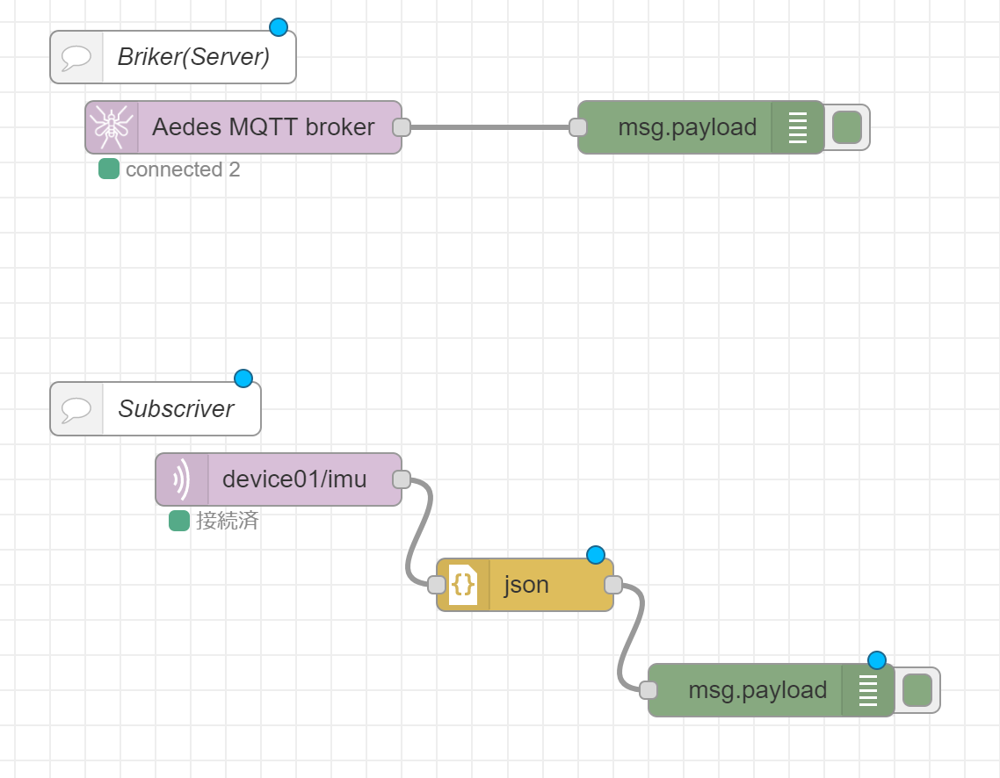

# IoT演習

## MQTTブローカーのセットアップ

armadillo IoT G3へMQTTブローカー機能を追加する．


利用ライブラリは以下

- node-red-contrib-aedes
    - node-red-contrib-aedes (node) - Node-RED (nodered.org)

### インストールは，ターミナルで行う．

```powershell

cd ~
cd .node-red
npm install node-red-contrib-aedes@0.5.2
cd ~

```

## node-redの起動

`ifconfig` コマンドで `eto0` および `wlan0` のIPアドレスを表示しメモを取っておく. 

`node-red` コマンドで起動する

ブローカが正常に起動すればmqtt://～～と表示される
```dotnetcli
6 Jul 11:59:28 - [info] Starting flows
6 Jul 11:59:28 - [info] Started flows
6 Jul 11:59:28 - [info] [aedes broker:5c318b9b.0588e4] Binding aedes mqtt server on port: 1883
6 Jul 11:59:29 - [info] [mqtt-broker:e345b3f7.76475] Connected to broker: mqtt://localhost:1883
```


## 今回のデータフロー

データフローは下図となる．今回はTopicを `[device_id]/bme` とし，Atomがpublisherとなりデータの送信を行い，node-red側のsubcriberノードを用いてデータの取得を行う．

<center>
  
</center>


## node-redによるMQTT通信


ブラウザで `http://[node-red IP-address]:1880` へアクセスする．

### 次のノードを配置して，BrokerとSubscriberを有効にする．

<center>
    
</center>

### 各ノードの設置内容は以下
- MQTT Broker
    - デフォルトのままでOK
- mqtt in
    - server
        - `localhost:1883`
    - topic
        - `[device_id]/bme`
            - 画像では，`device01/bme`となっている．

###  `デプロイ` ボタンをクリックしノードを有効化する