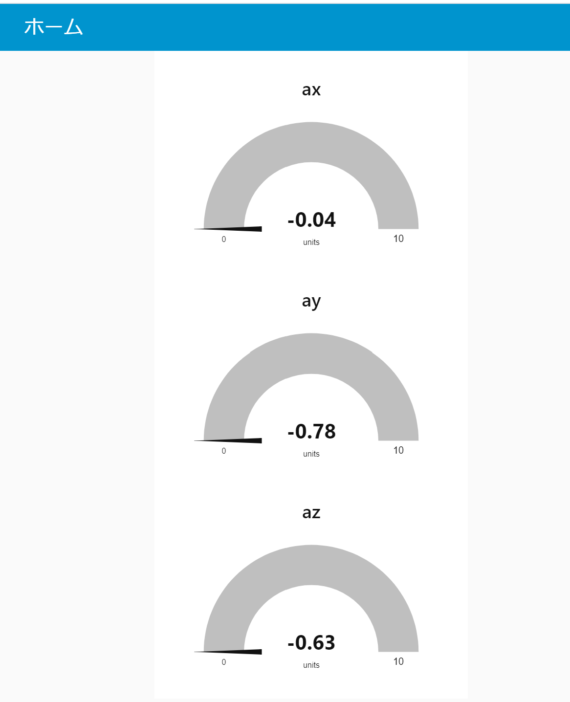

# IoT演習

## Atom MatrxをPublisherにして，センサ情報を送信する

以下のコードは，MQTTブローカへ加速度センサで取得したデータを送信します．

```
#include <M5Atom.h>
#include <WiFi.h>
#include <PubSubClient.h>
#include <ArduinoJson.h>


// WiFi
#include <WiFi.h>
#include <time.h>

// wifi config
#define WIFI_SSID "WiFiSSID" 
#define WIFI_PASSWORD "WiFiパスワード"

// MQTT config
#define MQTT_SERVER "IPアドレス"
#define MQTT_PORT 1883
#define MQTT_BUFFER_SIZE 128
#define TOPIC "device01/imu"

// デバイスID　デバイスIDは機器ごとにユニークにします
#define DEVICE_ID "atom001"

// 加速度センサ
#define M5STACK_MPU6886

float accX = 0.0F;
float accY = 0.0F;
float accZ = 0.0F;

// Ticker
#include <Ticker.h>
Ticker tickerMeasure;

// MQTT Publish
const int message_capacity = JSON_OBJECT_SIZE(3);
StaticJsonDocument<message_capacity> json_message;
char message_buffer[MQTT_BUFFER_SIZE];

// MQTT用インスタンス作成
WiFiClient espClient;
PubSubClient client(espClient);


// WiFiへの接続
void setupWiFi(){
  // connect wifi
  WiFi.begin(WIFI_SSID, WIFI_PASSWORD);  
  while (WiFi.status() != WL_CONNECTED) {
    Serial.println(".");
    delay(100);
    }

  Serial.println("");
  Serial.print("Connected : ");
  Serial.println(WiFi.localIP());
  // sync Time
  configTime( 3600L * 9, 0, "ntp.nict.jp", "ntp.jst.mfeed.ad.jp");

  // MQTTブローカに接続
  client.setServer(MQTT_SERVER, MQTT_PORT);

  // 1sごとにセンサデータを送信する
  tickerMeasure.attach_ms(1000, sendSensorData);

}


void sendSensorData(void){

  M5.IMU.getAccelData(&accX,&accY,&accZ);
  Serial.print(accX);
  Serial.print(",");
  Serial.print(accY);
  Serial.print(",");
  Serial.println(accZ);
  
  // ペイロードを作成して送信を行う．
  json_message.clear();
  json_message["ax"] = accX;
  json_message["ay"] = accY;
  json_message["az"] = accZ;
  serializeJson(json_message, message_buffer, sizeof(message_buffer));
  client.publish(TOPIC, message_buffer);
}


void setup() {
  
  // Initialize the M5Stack object
  M5.begin(true, false, true);

  // Initialize IMU
  M5.IMU.Init();

  // WiFi接続
  setupWiFi();

}

void loop() {
  client.loop();
  // MQTT未接続の場合は，再接続
  while(!client.connected() ){
    Serial.println("Mqtt Reconnecting");
    if( client.connect(DEVICE_ID) ){
      Serial.println("Mqtt Connected");
      break;
    }
    delay(1000);
  }

  M5.update();
}


```


プログラムをコンパイル・転送を行い，シリアルモニターで起動を確認する．


## node-red ダッシュボード機能

`node-red-dashboard` を利用することで容易にダッシュボードを作成することが可能となる．

### `node-red-dashboard` ノードの追加

パレットの管理から，ノードを追加を選択して，`node-red-dashboard` を検索し追加を行う．


### ダッシュボードの例

次の図は，Atom matrix より送信した データをゲージ表示したものである． 

<center>
    
</center>

