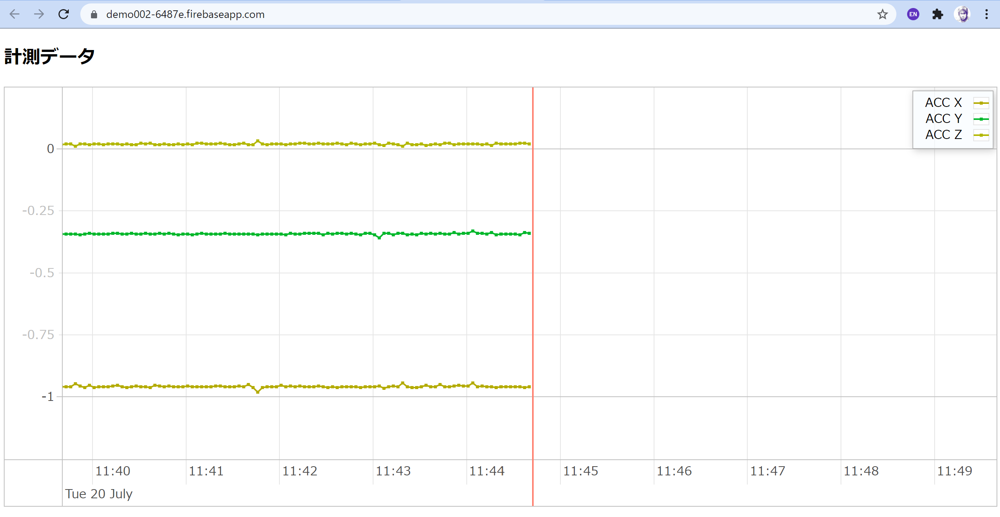

# IoT演習

## Cloudサービスのセットアップ

今回の演習では, Firebaseを利用します．


# Firebaseとは

[Firebase](https://firebase.google.com)はGoogle社が提供するモバイルプラットフォームです．iOS、Android、Web等でアプリケーションを構築し、モバイルサービスを提供する際に必要な機能を備えています．主な機能として、リアルタイムデータベース、ユーザー認証、ストレージ、ホスティング、ファンクション、通知等があります．


料金プランは，無料のSpark, 従量制のBlazeの2つのプランが存在します．プランに応じて，Realtime Databaseへの同時接続数であったり，Cloud Functionsの呼び出し数やなどに制限があります．各プランの制限事項などの詳細は公式サイトの [料金](https://firebase.google.com/pricing/`)ページで確認できます．

## Firebaseによるサーバの構築

データベースには、Firebase Realtime Databasを利用します．また、今後作成するWebアプリケーションの配置先として、Firebase Hostingを利用します．利用するFirebaseの機能概要は以下のとおりです．

### Firebase Realtime Database

Firebase Realtime Databaseはクラウドホスティング型のNoSQLデータベースであり、データとしてJSONデータを保存・同期します．Realtime Database SDKを使うことでリアルタイムに保存・同期を行い、オフラインにも対応します．


### Firebase Hosting

Firebase Hostingは、SPAを簡単に公開できます．CDNやHTTPSにも対応しています．

### Firebase Authentication

Firebase Authenticationは、ユーザー認証システムを簡単に構築できます．ログインプロバイダとして、メールアドレス、電話認証、Google、Twitter、Facebook、GitHubおよび匿名があります．


# 開発環境の準備

Firebaseを用いたサーバ構築に必要な開発環境を準備します．作成するWebサーバは、FirebaseのRealtime DatabaseとHosting機能を利用します．そのための設定を行っていきます．

## Firebaseの利用開始

Firebaseを利用開始するためには、コンソールページへログインします．ブラウザで `https://console.firebase.google.com` と入力し、Googleアカウントでログインします．

## Firebaseプロジェクトの作成

新規にプロジェクトを作成します．コンソールページの中央にある、"プロジェクトを追加"リンクをクリックします．プロジェクトを追加するポップアップ画面が表示されるので、プロジェクト名、プロジェクトID、国／地域を入力・選択していきます．


- プロジェクト名は、半角・英数・一部記号で4文字以上を入力します．
- プロジェクトIDを確認します．プロジェクトIDは、先ほど指定したプロジェクト名をベースに自動生成されます．なお、自動生成されたプロジェクトIDを変更したい場合は、鉛筆のアイコンをクリックすることで変更できます．このIDは、Realtime DatabaseやFirebase Hosting等のURLの一部となり、グローバルで一意である必要があります．画面上のヘルプ欄にもありますが、プロジェクトIDは後から変更できませんので注意が必要です．
- 国／地域を選択します．
- ３項目の入力・選択が完了したら "プロジェクトを作成" をクリックします．


## リアルタイムデータベースの作成

ブラウザのFirebase console上で，Realtime Databaseの項目をオープン，リアルタイムデータベースを作成します．

 

`データベースを作成` ボタンをクリック

### データベースを作成するロケーションを選択


`米国` を選択します．


### セキュリティルールの設定


今回は，`テストモード` を選択して実行します．


## Firebase CLIのインストール

Firebaseは、CLI(Command Line Interface)により、Firebaseプロジェクトの管理、操作、デプロイ(公開)を行います．


### Windows

Windowsは，以下のアドレスから，スタンドアロンバイナリをダウンロードして実行します

- https://firebase.tools/bin/win/instant/latest

ダウンロードした，バイナリを実行すると， `firebase` コマンドが実行可能なシェルがオープンします．

### macOS, Linux

macOS, Linuxでは，npmコマンドにより firebase-toolsをインストールします．

```bash
npm install -g firebase-tools
```

インストール後、ターミナルから `firebase` コマンドが利用可能になります．

## Firebase CLIでログイン

サーバ構築にあたり、先ほど作成したFirebaseプロジェクトを利用するためにターミナルを使ってFirebaseへログインします． `fireabse` コマンドに続き `login`　と入力します．

```bash
firebase login
```

コマンドを入力するとブラウザが立ち上がり、Goolgeアカウント認証のページが表示されます．認証後、Firebase CLIのアクセスを許可します．

```bash
✔  Success! Logged in as xxx@gmail.com
```

なお、`firebase logout` コマンドを入力するとFirebase CLIはログアウトします．

## Firebaseプロジェクトの初期化

コンソールで作成したプロジェクトに対して、Hostingの機能を利用できるようにしていきます．

ターミナルでプロジェクト用のディレクトリを作成します．今回は，`iot_host`名でディレクトリを作成する．このディレクトリ内がFirebaseプロジェクトのディレクトリとなります．

```bash
mkdir iot_host
cd iot_host
```

### Hostingの設定

Firebase Hostingの設定を行います．ターミナルで `firebase init hosting` コマンドを入力します．ターミナルには、Firebaseプロジェクトが一覧に表示されるので、該当するプロジェクトを選択します．設定が終わりますと以下のようなディレクトリ構成になります．

```bash
.
├── firebase.json
└── public
    ├── 404.html
    └── index.html
```


# Webサイトの作成

Realtime Databaseに保存されたデータをグラフ化するWebサイトをFirebase Hostingを使い作成をしていきます．

Realtime Database 内に，以下のように保存された，データを可視化していきます．


```bash
.
└── stations
    └── [station_id]
        ├── status
        |   └── led
        └── data
            ├── -MZMUBJ_9MfN1vEOZG-V
            ├── -MZMUBJ_9MfN1vEOZG-C
            |   ├── acc_x
            |   ├── acc_y
            |   └── acc_z
            └── -MZMUC-11Nq_J6FYCYUK
```


前節でセットアップしたpublicディレクトリ内のファイル `index.html` を編集します．

`public` ディレクトリに移動します．

```bash
cd public
```

## index.htmlを下記のように修正する

エクスプローラ(Windows)やファインダー(macOS)でプロジェクトディレクトリ`iot_host` をオープンし `public` フォルダへ移動します．

`public` フォルダ内の `index.html` の内容を以下の通りに修正します．

```html
<!DOCTYPE html>
<html>
  <head>
    <meta charset="utf-8">
    <meta name="viewport" content="width=device-width, initial-scale=1">
    <title>データの可視化</title>

    <!-- update the version number as needed -->
    <script defer src="/__/firebase/8.7.1/firebase-app.js"></script>
    <!-- include only the Firebase features as you need -->
    <script defer src="/__/firebase/8.7.1/firebase-auth.js"></script>
    <script defer src="/__/firebase/8.7.1/firebase-database.js"></script>
    <!-- initialize the SDK after all desired features are loaded -->
    <script defer src="/__/firebase/init.js"></script>

    <script src="https://cdnjs.cloudflare.com/ajax/libs/vis/4.21.0/vis.min.js"></script>

    <link rel="stylesheet" type="text/css" href="https://cdnjs.cloudflare.com/ajax/libs/vis/4.21.0/vis.min.css" />

    <style type="text/css">
        .style-0 {
            fill: #f2ea00;
            fill-opacity: 0;
            stroke-width: 2px;
            stroke: #b3ab00;
        }
        .style-1 {
            fill: #00b72b;
            fill-opacity: 0;
            stroke-width: 2px;
            stroke: #00b72b;
        }

        .style-2 {
            fill: #b2b700;
            fill-opacity: 0;
            stroke-width: 2px;
            stroke: #b2b700;
        }

    </style>

  </head>
  <body>


  <h2>計測データ</h2>


  <div id="visualization"></div>


  <script type="text/javascript">

    document.addEventListener('DOMContentLoaded', function() {

      let app = firebase.app();
      let station_id = "st001";
      let container = document.getElementById('visualization');
      let names = ['ACC X', 'ACC Y', 'ACC Z'];
      let dataset = new vis.DataSet();
      let groups = new vis.DataSet();
      
      groups.add({
          id: 0,
          content: names[0],
          className: 'style-0',
          options: {
            yAxisOrientation: 'left',
            interpolation: false,
            drawPoints: {
                size: 2
            }
          }
      });

      groups.add({
          id: 1,
          content: names[1],
          className: 'style-1',
          options: {
            yAxisOrientation: 'left',
            interpolation: false,
            drawPoints: {
              size: 2
            }
          }
      });

      groups.add({
          id: 2,
          content: names[2],
          className: 'style-2',
          options: {
            yAxisOrientation: 'left',
            interpolation: false,
            drawPoints: {
              size: 2
            }
          }
      });


      let date = new Date();
      let options = {
          dataAxis: {
              showMinorLabels: true,
              alignZeros: false
          },
          width: '100%',
          height: '550px',
          legend: { left: { position: "top-right" } },
          start: date.setMinutes(date.getMinutes() - 5),
          end: date.setMinutes(date.getMinutes() + 15)

      };
      let graph2d = new vis.Graph2d(container, dataset, groups, options);

      var ref = app.database().ref('stations').child(station_id + '/data');
      ref.limitToLast(100).on('child_added', function(snapshot) {
          var newData = snapshot.val();
          addItem(newData.timestamp, newData.ax, 0);
          addItem(newData.timestamp, newData.ay, 1);
          addItem(newData.timestamp, newData.az, 2);
          let now = new Date();
          graph2d.setWindow(now.setMinutes(now.getMinutes() - 5), now.setMinutes(now.getMinutes() + 10), {animation: false});
      });

      function addItem(timestamp, value, g) {
          itm = { x: new Date(timestamp).toLocaleString(), y: value, group: g };
          dataset.add(itm);
      }

    });
  </script>

  </body>
</html>

```


### Webアプリケーションの公開

作成したページを公開します．


プロジェクトのルート(iot_host)に移動して，


ターミナルを使い以下のコマンドを入力します．

```bash
cd ..
firebase deploy
```

しばらく待ちます．デプロイが完了すると、ターミナル上に`Deploy complete!`のメッセージとともに、アドレスが表示されます．

```bash

=== Deploying to '{プロジェクトID}'...

...中略...

+ Deploy complete!

Project Console: https://console.firebase.google.com/project/xxxxx/overview
Hosting URL: https://xxxxx.web.app

```

`Hosting URL` のアドレスをブラウザに入力し表示確認をします．


# Node-RED からWebアプリケーションへのデータ送信

Node-REDを用いて，作成したFirebase上のWebアプリケーションへデータを送信します．

## node-redへノードのインストール

Node-REDがFirebaseと通信が可能となるように，ノードを追加します．

node-REDを起動し，`パレットの管理 > ノードの追加`  を開き， `node-red-contrib-firebase-data` ノードを追加します．

## Realtime Databaseへのデータ送信

### `Add Firebase` ノードの追加

パレットから，`Add Firebase` ノードを追加し，ノードの設定を行います．


1. Realtime Databaseへ接続するための認証設定を追加します．鉛筆アイコンをクリックして，FirebaseCertificateダイアログを表示します．
2. 自身のRealtime DatabaseのURLを入力します．今回，RealtimeDatabaseはテストモードとして設定してあるので，`Auth type` は`None` を選択してください．
3. デバイスから送信されてきたデータの保存パスを設定します．
4.  `Method` は，新規追加なので，`push` を選択します．

### MQTTノードとの接続


MQTTノードと接続していきます．M5デバイスからMQTTプロトコルで送信されてくるデータには，時刻情報がないため，Node-Red上で時刻を追加していきます．

`Function` ノードを間に挟みます．ノード内の`コード`欄に次のプログラムを記述します．

```javascript
msg.payload.timestamp = Date.now();
return msg;
```

Node-Redの右上の `デプロイ` ボタンを押して反映させます．

## データの確認

### Realtime Databaseコンソールで確認

WebのFirebaseコンソールでプロジェクトへアクセスし，Realtime databaseの画面を表示します．

データが送信されていれば，コンソール上でリアルタイムにデータが追加されてるのが確認できます．


### Firebse HostingのWebアプリで確認

Webアプリケーションでも確認します．WebのFirebaseコンソールでプロジェクトないのHostingの画面を表示します．画面の `[プロジェクトID]のドメイン`項目には，Webアプリがホスティングされているドメインのリストがあります．リスト内のURLをオープンします．


横軸を時間で `x, y, z` の加速度のデータがグラフ表示されているのが確認できます．




# リファレンス

- Firebase Documents
  - https://firebase.google.com/docs/
  - Realtime databae REST
    - [データの取得](https://firebase.google.com/docs/database/rest/retrieve-data?hl=ja)
    - [データの保存](https://firebase.google.com/docs/database/rest/save-data?hl=ja)