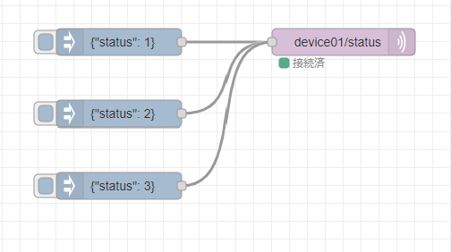

# IoT演習

## MQTT Subscribe

MQTTサーバからの情報を処理する．Subscriberの機能を実装することでサーバーからの要求に応じたデバイスの処理を行うことができます．


## Subscriberへの通知



`mqtt out` ノードを配置して，トピックに `device01/status` と入力します．このノードに `indject` ノードを接続します．`inject` ノードのpayload は`json` として，それぞれに，status: 1 to 3 を入力します．

```json
{"status": 1}
```


# Subscriberの機能追加

トピック  `device01/status` へ 0から3のstatusコードに応じてデバイス(Atom matrix)のLED表示色を変更します．
※ M5 stickの場合はdisplayの表示を変更してみてください．


## Arduino codeを次のコードを入力します．

```cpp
#include <M5Atom.h>
#include <WiFi.h>
#include <PubSubClient.h>
#include <ArduinoJson.h>
#include <time.h>

// wifi config
#define WIFI_SSID "robot2" 
#define WIFI_PASSWORD "robot2090"

// MQTT config
#define MQTT_SERVER "GW IP Address"
#define MQTT_PORT 1883
#define MQTT_BUFFER_SIZE 128
#define TOPIC "device01/imu"
#define TOPIC_STATUS "device01/status"

// デバイスID　デバイスIDは機器ごとにユニークにします
#define DEVICE_ID "atom-xxx"

// 加速度センサ
#define M5STACK_MPU6886

float accX = 0.0F;
float accY = 0.0F;
float accZ = 0.0F;

// Ticker
#include <Ticker.h>
Ticker tickerMeasure;


// MQTT Subscribe
const int request_capacity = JSON_OBJECT_SIZE(4);
StaticJsonDocument<request_capacity> json_request;

// MQTT Publish
const int message_capacity = JSON_OBJECT_SIZE(3);
StaticJsonDocument<message_capacity> json_message;
char message_buffer[MQTT_BUFFER_SIZE];

// MQTT用インスタンス作成
WiFiClient espClient;
PubSubClient client(espClient);

// LEDステータス
unsigned long led_status = 0;


// MQTT Subscribeのコールバック
void mqttCallback(char* topic, byte* payload, unsigned int length) {

  
  DeserializationError err = deserializeJson(json_request, payload, length);
  if( err ){
    Serial.println("Deserialize error");
    Serial.println(err.c_str());
    return;
  }

  serializeJson(json_request, Serial);
  Serial.println("");

  led_status = json_request["status"];

}


// WiFiへの接続
void setupWiFi(){
  // connect wifi
  WiFi.begin(WIFI_SSID, WIFI_PASSWORD);  
  while (WiFi.status() != WL_CONNECTED) {
    Serial.println(".");
    delay(100);
    }

  Serial.println("");
  Serial.print("Connected : ");
  Serial.println(WiFi.localIP());
  // sync Time
  configTime( 3600L * 9, 0, "ntp.nict.jp", "ntp.jst.mfeed.ad.jp");

  // MQTTブローカに接続
  client.setServer(MQTT_SERVER, MQTT_PORT);

  // 3sごとにセンサデータを送信する
  tickerMeasure.attach_ms(3000, sendSensorData);

  // MQTT subscribeの設定
  client.setCallback(mqttCallback); 
  

}


void sendSensorData(void){

  M5.IMU.getAccelData(&accX,&accY,&accZ);
  Serial.print(accX);
  Serial.print(",");
  Serial.print(accY);
  Serial.print(",");
  Serial.println(accZ);
  
  // ペイロードを作成して送信を行う．
  json_message.clear();
  json_message["ax"] = accX;
  json_message["ay"] = accY;
  json_message["az"] = accZ;
  serializeJson(json_message, message_buffer, sizeof(message_buffer));
  client.publish(TOPIC, message_buffer);
}


void setup() {
  
  // Initialize the M5Stack object
  M5.begin(true, false, true);
  M5.dis.drawpix(0, 0xf00000);

  // Initialize IMU
  M5.IMU.Init();

  // WiFi接続
  setupWiFi();
}


void loop() {
  client.loop();
  // MQTT未接続の場合は，再接続
  while(!client.connected() ){
    Serial.println("Mqtt Reconnecting");
    if( client.connect(DEVICE_ID) ){
      client.subscribe(TOPIC_STATUS);
      Serial.println("Mqtt Connected");
      break;
    }
    delay(1000);
  }

  switch (led_status)
  {
  case 0:
      M5.dis.drawpix(0, 0xf00000);
      break;
  case 1:
      M5.dis.drawpix(0, 0x00f000);
      break;
  case 2:
      M5.dis.drawpix(0, 0x0000f0);
      break;
  case 3:
      M5.dis.drawpix(0, 0x707070);
      break;
  default:
      break;
  }

  M5.update();
}


```

 
Node-RED のFlowをデプロイします． `inject` ノードをクリックしてAtom MatrixのLEDの色が変化することを確認します．


# チャレンジ：Firebaseとの連携

FirebaseのRealtime Database 内のデバイスのLEDの状態に応じて，Atom MatrixのLEDの色を変更するようにプログラミングしてみましょう．

