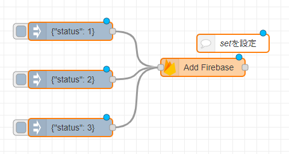
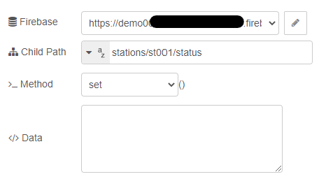
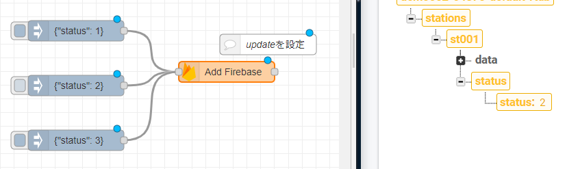
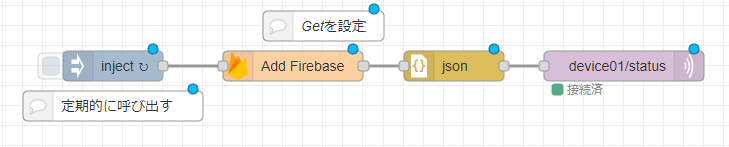
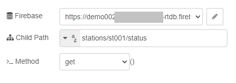
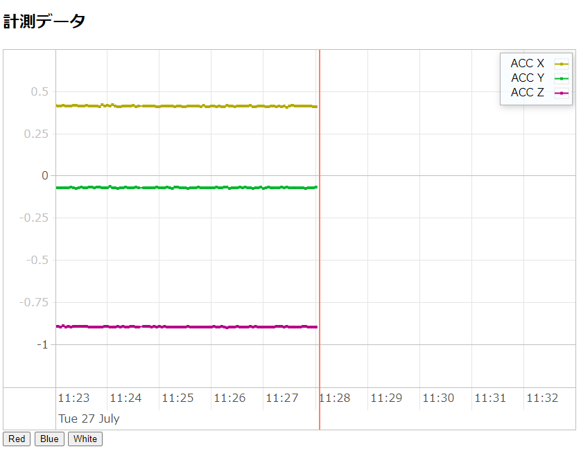

# IoT演習


# Firebaseとの連携

これまで MQTT Subscriber を利用して，ゲートウェイ機器からAtom MatrixのLEDカラーを変更することができました．さらに，FirebaseのRealtime databaseと連携してクラウドからAtom matrixのLED色を変更していきます．


## `Realtime database`へLEDの状態を保存する．

加速度データと同様に，`Add Firebase`を利用していきます．

加速度データの保存先は，`stations/st001/data`でした．LEDの状態の保存先は， `stations/st001/status` とします． 加速度の時は，新規にデータを追加していたので，`push`メソッドを使っていましたが，今回は，そのパス上のデータ更新ですので，`set`メソッドを使います．

これまでに作成したフローを活用していきます．
MQTT Subscribe様に作成したフローの `inject`ノードと `mqtt out` を切り離します．
 `Add Firebase` ノードを追加し，切り離した`inject`ノードと接続します．



 
 追加した`Add Firebase`の設定を開き，
 - `Firebase`項目は，前回設定した，firebase Realtimeの設定を選択します．
 - `Child Path` は，`stations/st001/status`を入力します．このパスに，デバイスのLEDのカラー状態を設定します．
 - `_Method`は，`set`を選択します．
 



それぞれの `inject` ノードを操作することで，Realtime Database内の状態を変更することができます．



図は，Node-RED内の 2つめの`indect`ノードを操作したさいに，Realtime Database内のデータが更新されている様子です．


## `Realtime database`内のデータを取得して，MQTTで通知する

Realtime Database内のパス`stations/st001/status` のデータを取得して，MQTTでサブスライバーへ通知していきます．
取得でも，`Add Firebase`ノードを利用します．しかし，このノードは，Realtime Databaseの変更監視(`.on`イベント)をすることはできません．`inject`ノードの定期実行機能を利用していきます．

新たに，`Add Firebase` ノードを追加します．図の様に，ノードを配置接続していきます．`mqtt out` ノードは前節で切り離したものです．


 
 追加した`Add Firebase`の設定を開き，
 - `Firebase`項目は，前回設定した，firebase Realtimeの設定を選択します．
 - `Child Path` は，`stations/st001/status`を入力します．このパスに，デバイスのLEDのカラー状態を設定します
 - `_Method`は，`get`を選択します．
 




Realtime Databaseに設定したLEDの状態に応じてデバイスのLEDを変更することが可能となりました．


## WebアプリケーションからLEDを操作する

WebアプリケーションからRealtime Databaseを操作して，LEDの状態を変更していきます．Webページ内にボタンを設置し，ボタンを押すことでLEDの状態を更新するようにします．

フォーム要素のボタンをHTML内に作成し，`onclick`イベントでRealtime Database内のデータを更新していきます．

Firebase CLIを起動します．Firebase CLI内で，プロジェクトディレクトリに移動します．

Firebase プロジェクトの `public` フォルダ内の `index.html` の内容を以下の通りに修正します.

```html
<!DOCTYPE html>
<html>
  <head>
    <meta charset="utf-8">
    <meta name="viewport" content="width=device-width, initial-scale=1">
    <title>データの可視化 001</title>

    <!-- update the version number as needed -->
    <script defer src="/__/firebase/8.7.1/firebase-app.js"></script>
    <!-- include only the Firebase features as you need -->
    <script defer src="/__/firebase/8.7.1/firebase-auth.js"></script>
    <script defer src="/__/firebase/8.7.1/firebase-database.js"></script>
    <!-- initialize the SDK after all desired features are loaded -->
    <script defer src="/__/firebase/init.js"></script>

    <script src="https://cdnjs.cloudflare.com/ajax/libs/vis/4.21.0/vis.min.js"></script>

    <link rel="stylesheet" type="text/css" href="https://cdnjs.cloudflare.com/ajax/libs/vis/4.21.0/vis.min.css" />

    <style type="text/css">
        .style-0 {
            fill: #f2ea00;
            fill-opacity: 0;
            stroke-width: 2px;
            stroke: #b3ab00;
        }
        .style-1 {
            fill: #00b72b;
            fill-opacity: 0;
            stroke-width: 2px;
            stroke: #00b72b;
        }

        .style-2 {
            fill: #b70089;
            fill-opacity: 0;
            stroke-width: 2px;
            stroke: #b70089;
        }

    </style>

  </head>
  <body>


  <h2>計測データ</h2>


  <div id="visualization"></div>


  <script type="text/javascript">

    let station_id = "st001";

    document.addEventListener('DOMContentLoaded', function() {

      let app = firebase.app();    
      let container = document.getElementById('visualization');
      let names = ['ACC X', 'ACC Y', 'ACC Z'];
      let dataset = new vis.DataSet();
      let groups = new vis.DataSet();
      
      groups.add({
          id: 0,
          content: names[0],
          className: 'style-0',
          options: {
            yAxisOrientation: 'left',
            interpolation: false,
            drawPoints: {
                size: 2
            }
          }
      });

      groups.add({
          id: 1,
          content: names[1],
          className: 'style-1',
          options: {
            yAxisOrientation: 'left',
            interpolation: false,
            drawPoints: {
              size: 2
            }
          }
      });

      groups.add({
          id: 2,
          content: names[2],
          className: 'style-2',
          options: {
            yAxisOrientation: 'left',
            interpolation: false,
            drawPoints: {
              size: 2
            }
          }
      });

      let date = new Date();
      let options = {
          dataAxis: {
              showMinorLabels: true,
              alignZeros: false
          },
          width: '100%',
          height: '550px',
          legend: { left: { position: "top-right" } },
          start: date.setMinutes(date.getMinutes() - 5),
          end: date.setMinutes(date.getMinutes() + 15)

      };
      let graph2d = new vis.Graph2d(container, dataset, groups, options);

      var ref = app.database().ref('stations').child(station_id + '/data');
      ref.limitToLast(100).on('child_added', function(snapshot) {
          var newData = snapshot.val();
          addItem(newData.timestamp, newData.ax, 0);
          addItem(newData.timestamp, newData.ay, 1);
          addItem(newData.timestamp, newData.az, 2);
          let now = new Date();
          graph2d.setWindow(now.setMinutes(now.getMinutes() - 5), now.setMinutes(now.getMinutes() + 10), {animation: false});
      });

      function addItem(timestamp, value, g) {
          itm = { x: new Date(timestamp).toLocaleString(), y: value, group: g };
          dataset.add(itm);
      }

    });
  </script>

  <script type="text/javascript">
    function change_status(st){
      let ref = firebase.database().ref('stations').child(station_id + '/status');
      ref.set({status: st});
    }
  </script>

  <div>
    <button onclick="change_status(1);">Red</button>
    <button onclick="change_status(2);">Blue</button>
    <button onclick="change_status(3);">White</button>
  </div>

  </body>
</html>
```


これまでのindex.htmlとの違いは，フォーム要素のボタンを追加していること，ボタンをクリックしたときの関数が追加されている点です．
```html
  <script type="text/javascript">
    function change_status(st){
      let ref = firebase.database().ref('stations').child(station_id + '/status');
      ref.set({status: st});
    }
  </script>

  <div>
    <button onclick="change_status(1);">Red</button>
    <button onclick="change_status(2);">Blue</button>
    <button onclick="change_status(3);">White</button>
  </div>
```

Firebaes CLIツールで，以下のコマンドを入力します．

```bash
firebase deploy
```

CLIツールで最後に表示される，`Hosting URL` のアドレスをブラウザに入力し確認をします．




ボタンをクリックすることで，Realtime Database内の状態が更新され，それに伴い，Atom MatrixのLEDの色が変更されるのが確認できます．


# リファレンス

- Firebase Documents
  - https://firebase.google.com/docs/
  - ウェブでのデータの読み取りと書き込み
    - https://firebase.google.com/docs/database/web/read-and-write?hl=ja


