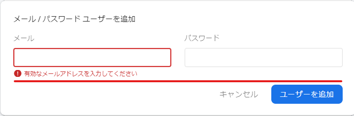

# IoT演習


# Webアプリケーションにログイン機能の追加

演習では，Firebaseの認証機能である，Firebase Authenticationを利用します．
また，FirebaseUIライブラリにより簡単に認証機能を追加することができます．


[FirebaseUI](https://github.com/firebase/firebaseui-web)は，Firebase Authntication SDKをベースに作成されたライブラリーとなり,ドロップイン認証フローを簡単に実装できます．FirebaseUIには，以下の利点があります．

- 複数のログインプロバイダに対応: メールとパスワードのログインフロー，メールリンク，電話認証，Google，Facebook，Twitter、GitHub によるログインに対応
- カスタマイズ: アプリの要件に合わせて FirebaseUI の CSS スタイルの変更可能
- ローカライズされた UI: 国際化によって 40 以上の言語に対応

## 認証の流れ


計測ページにて，計測データを閲覧するためにはログインが必要と仕様変更します．流れは以下の通りです．

- ページへアクセス
- 認証されていない場合，ログインダイアログの表示
- 認証されている場合，計測データの表示

これまでは，ページへアクセスしたら直接データを表示していました．データ取得・グラフ表示処理を行う前にログイン処理の機能を追加していきます．


## Firebase Consoleで認証機能を有効にする

### 左側のメニューより，Authenticationを選択し，「始める」をクリックします

<center>

</center>


### ログインプロバイダを選択します．今回は「メール/パスワード」を選択します．

<center>

</center>

### 「メール/パスワード」を有効にします．

<center>

</center>

<center>

</center>

### ユーザーを追加します

メールアドレスとパスワードを入力します．

<center>

</center>

<center>

</center>


## FirebaseUI の準備

FirebaseUIライブラリをCDNを用いた方法で導入します．

これまでの `index.html` の head タグ内に以下の行を追加します．
```html
    <!-- Firebase Auth UI-->
    <script src="https://www.gstatic.com/firebasejs/ui/6.0.1/firebase-ui-auth.js"></script>
    <link type="text/css" rel="stylesheet" href="https://www.gstatic.com/firebasejs/ui/6.0.1/firebase-ui-auth.css" />
```

これにより，ページにFirebaseUIの機能が利用できるようになります．


## ログイン機能の実装

`<body>`タグの直下に以下のタグを追加します．この`<div>`タグ内にログインダイアログが表示されます．

```html
 <div id="firebaseui-auth-container"></div>
```

`firebase.auth()`の関数を使い，ログインの有無を調べます．未ログインの時はFirebaseUIによるログインを，ログイン済みの時はグラフ表示を行います．

```javascript
      firebase.auth().onAuthStateChanged((user) => {
            if (user) {
                // User is signed in, see docs for a list of available properties
                // https://firebase.google.com/docs/reference/js/firebase.User
                var uid = user.uid;
                document.getElementById('buttons').style.display = 'block';
                show_data();
            } else {
                // User is signed out
                console.log("no login")
                var uiConfig = {
                    // ログイン成功時のリダイレクト先
                    signInSuccessUrl: 'index.html',

                    // 利用する認証機能
                    signInOptions: [
                        firebase.auth.EmailAuthProvider.PROVIDER_ID
                    ],
                };

                var ui = new firebaseui.auth.AuthUI(firebase.auth());
                ui.start('#firebaseui-auth-container', uiConfig);                
            }
        });
    });
```

ログアウト処理は以下となります．
```javascript
    function logout() {
            firebase.auth().signOut().then(() => {
                // ログアウト成功
                document.location = 'index.html';
            }).catch((error) => {
                // ログアウトエラー処理
            });

    }
```

これまでのグラフ表示に関する記述を`show_data`関数にします．

```javascript
    function show_data(){

      let app = firebase.app();
      //let station_id = "st001";
      let container = document.getElementById('visualization');
      let names = ['Humidity', 'Pressure', 'Templature'];
      let dataset = new vis.DataSet();
      let groups = new vis.DataSet();
      
      groups.add({
          id: 0,
          content: names[0],
          className: 'style-0',
          options: {
            yAxisOrientation: 'left',
            interpolation: false,
            drawPoints: {
                size: 2
            }
          }
      });

      groups.add({
          id: 1,
          content: names[1],
          className: 'style-1',
          options: {
            yAxisOrientation: 'left',
            interpolation: false,
            drawPoints: {
              size: 2
            }
          }
      });

      groups.add({
          id: 2,
          content: names[2],
          className: 'style-2',
          options: {
            yAxisOrientation: 'left',
            interpolation: false,
            drawPoints: {
              size: 2
            }
          }
      });

      let date = new Date();
      let options = {
          dataAxis: {
              showMinorLabels: true,
              alignZeros: false
          },
          width: '100%',
          height: '550px',
          legend: { left: { position: "top-right" } },
          start: date.setMinutes(date.getMinutes() - 5),
          end: date.setMinutes(date.getMinutes() + 15)

      };
      let graph2d = new vis.Graph2d(container, dataset, groups, options);

      var ref = app.database().ref('stations').child(station_id + '/data');
      ref.limitToLast(100).on('child_added', function(snapshot) {
          var newData = snapshot.val();
          addItem(newData.timestamp, newData.humid, 0);
          addItem(newData.timestamp, newData.press, 1);
          addItem(newData.timestamp, newData.temp, 2);
          let now = new Date();
          graph2d.setWindow(now.setMinutes(now.getMinutes() - 5), now.setMinutes(now.getMinutes() + 10), {animation: false});
      });
    }

```


### index.htmlの全体

資料として`index_03.html`が該当します．

```html
<!DOCTYPE html>
<html>
  <head>
    <meta charset="utf-8">
    <meta name="viewport" content="width=device-width, initial-scale=1">
    <title>データの可視化</title>

    <!-- update the version number as needed -->
    <script defer src="/__/firebase/8.7.1/firebase-app.js"></script>
    <!-- include only the Firebase features as you need -->
    <script defer src="/__/firebase/8.7.1/firebase-auth.js"></script>
    <script defer src="/__/firebase/8.7.1/firebase-database.js"></script>
    
    <!-- initialize the SDK after all desired features are loaded -->
    <script defer src="/__/firebase/init.js"></script>

    <!-- Firebase Auth UI-->
    <script src="https://www.gstatic.com/firebasejs/ui/6.0.1/firebase-ui-auth.js"></script>
    <link type="text/css" rel="stylesheet" href="https://www.gstatic.com/firebasejs/ui/6.0.1/firebase-ui-auth.css" />

    <!-- vis.js -->
    <script src="https://cdnjs.cloudflare.com/ajax/libs/vis/4.21.0/vis.min.js"></script>

    <link rel="stylesheet" type="text/css" href="https://cdnjs.cloudflare.com/ajax/libs/vis/4.21.0/vis.min.css" />

    <style type="text/css">
        .style-0 {
            fill: #f2ea00;
            fill-opacity: 0;
            stroke-width: 2px;
            stroke: #b3ab00;
        }
        .style-1 {
            fill: #00b72b;
            fill-opacity: 0;
            stroke-width: 2px;
            stroke: #00b72b;
        }

        .style-2 {
            fill: #b2b700;
            fill-opacity: 0;
            stroke-width: 2px;
            stroke: #b2b700;
        }

    </style>  

  </head>
  <body>

  <div id="firebaseui-auth-container"></div>

  <h2>計測データ</h2>

  <div id="visualization"></div>

  <script type="text/javascript">

    document.addEventListener('DOMContentLoaded', function() {

      firebase.auth().onAuthStateChanged((user) => {
            if (user) {
                // User is signed in, see docs for a list of available properties
                // https://firebase.google.com/docs/reference/js/firebase.User
                var uid = user.uid;
                document.getElementById('buttons').style.display = 'block';
                show_data();
            } else {
                // User is signed out
                console.log("no login")
                var uiConfig = {
                    // ログイン成功時のリダイレクト先
                    signInSuccessUrl: 'index.html',

                    // 利用する認証機能
                    signInOptions: [
                        firebase.auth.EmailAuthProvider.PROVIDER_ID
                    ],
                };

                var ui = new firebaseui.auth.AuthUI(firebase.auth());
                ui.start('#firebaseui-auth-container', uiConfig);                
            }
        });
    });

    function logout() {
            firebase.auth().signOut().then(() => {
                // ログアウト成功
                document.location = 'index.html';
            }).catch((error) => {
                // ログアウトエラー処理
            });

    }
  </script>

  <script type="text/javascript">

    let station_id = "st001";

    function show_data(){

      let app = firebase.app();
      //let station_id = "st001";
      let container = document.getElementById('visualization');
      let names = ['Humidity', 'Pressure', 'Templature'];
      let dataset = new vis.DataSet();
      let groups = new vis.DataSet();
      
      groups.add({
          id: 0,
          content: names[0],
          className: 'style-0',
          options: {
            yAxisOrientation: 'left',
            interpolation: false,
            drawPoints: {
                size: 2
            }
          }
      });

      groups.add({
          id: 1,
          content: names[1],
          className: 'style-1',
          options: {
            yAxisOrientation: 'left',
            interpolation: false,
            drawPoints: {
              size: 2
            }
          }
      });

      groups.add({
          id: 2,
          content: names[2],
          className: 'style-2',
          options: {
            yAxisOrientation: 'left',
            interpolation: false,
            drawPoints: {
              size: 2
            }
          }
      });

      let date = new Date();
      let options = {
          dataAxis: {
              showMinorLabels: true,
              alignZeros: false
          },
          width: '100%',
          height: '550px',
          legend: { left: { position: "top-right" } },
          start: date.setMinutes(date.getMinutes() - 5),
          end: date.setMinutes(date.getMinutes() + 15)

      };
      let graph2d = new vis.Graph2d(container, dataset, groups, options);

      var ref = app.database().ref('stations').child(station_id + '/data');
      ref.limitToLast(100).on('child_added', function(snapshot) {
          var newData = snapshot.val();
          addItem(newData.timestamp, newData.humid, 0);
          addItem(newData.timestamp, newData.press, 1);
          addItem(newData.timestamp, newData.temp, 2);
          let now = new Date();
          graph2d.setWindow(now.setMinutes(now.getMinutes() - 5), now.setMinutes(now.getMinutes() + 10), {animation: false});
      });
    }

    function addItem(timestamp, value, g) {
          itm = { x: new Date(timestamp).toLocaleString(), y: value, group: g };
          dataset.add(itm);
    }
    
  </script>

  <script type="text/javascript">
    function change_status(st){
      let ref = firebase.database().ref('stations').child(station_id + '/status');
      ref.set({status: st});
    }
  </script>

  <div id="buttons" style="display: none;">
    <button onclick="change_status(1);">COLOR 1</button>
    <button onclick="change_status(2);">COLOR 2</button>
    <button onclick="change_status(3);">COLOR 3</button>

    <button onClick="logout()" style="float:right;">ログアウト</button>
  </div>

  </body>
</html>

```


## デプロイして確認


```bash
firebase deploy
```

デプロイされたURLへアクセス,次の状態になっています．

<center>

</center>
