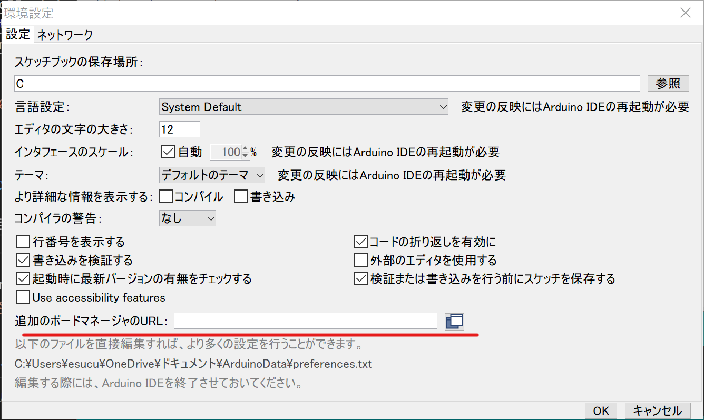
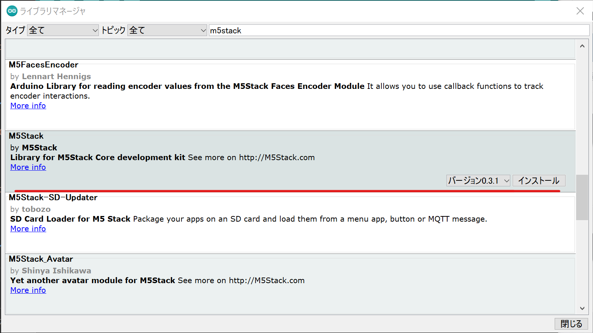

# ArduinoとFirebaseではじめる観測ステーション

Arduinoとfirebase hosting用のサンプルコードです．

## 利用ハードおよびサービス

- M5Stack
  - https://www.m5stack.com/
  - https://github.com/m5stack/M5Stack
- M5Stack Basic
  - https://docs.m5stack.com/en/core/basic
- M5Stack Gray
  - https://docs.m5stack.com/en/core/gray
- M5StickC
  - https://docs.m5stack.com/en/core/m5stickc
- M5Atom Matrix
  - https://docs.m5stack.com/en/core/atom_matrix
- Firebase
  - https://firebase.google.com/

## IDE

Arduino IDEのほかに，Visual Studio Codeをインストールしておくことを勧めます．

- Arduino IDE
  - https://www.arduino.cc/en/Main/Software
- Visual Studio code
  - https://code.visualstudio.com/

## M5Stackの環境構築

Arduino IDEでM5Stackを利用するための環境構築を行います．

- [M5Stack環境セットアップ(windows)](https://docs.m5stack.com/#/en/quick_start/m5core/m5stack_core_get_started_Arduino_Windows?id=step1-download-arduino-esp32-support)
- [M5Stack環境セットアップ(mac)](https://docs.m5stack.com/#/en/quick_start/m5core/m5stack_core_get_started_Arduino_MacOS)

### USBドライバのインストール

CP2104 driverを以下のアドレスよりダウンロードしてインストールします.

- [Windows](https://m5stack.oss-cn-shenzhen.aliyuncs.com/resource/drivers/CP210x_VCP_Windows.zip)
- [macOS](https://m5stack.oss-cn-shenzhen.aliyuncs.com/resource/drivers/CP210x_VCP_MacOS.zip)
- [Linux](https://m5stack.oss-cn-shenzhen.aliyuncs.com/resource/drivers/CP210x_VCP_Linux.zip)

    

### Arduino IDEセットアップ

#### ESP32 ボードマネージャの追加

Arduino IDE内の環境設定における追加ボードマネージャに記述するアドレスは以下となります

- Arduino-ESP32 Support
  - `https://dl.espressif.com/dl/package_esp32_index.json`

    

ツールメニューよりボードマネージャを選択し，`esp32` で検索を行います．
検索結果から，`esp32 by Espressif Systems` のパッケージをインストールします．

    

#### M5Stackデバイスに応じたボードの選択

`M5Stack basic, Gray, StickC, Atom` 等，自身が利用するデバイスに合わせてボードを選択します．

    

#### M5Stackデバイスに応じたライブラリのインストール

ツールメニューライブラリを管理からライブラリマネージャ画面を開き，デバイスに応じたライブラリをインストールします．

- m5Stack {Basic, Gray}
  - m5stack
- m5StcickC
  - m5StickC
- m5Atom
  - m5Atom
  - FastLED

  

写真はm5stack Basic, Grayデバイスの時のライブラリ

## 利用するArduino用ライブラリ

### Firebaseとの通信用ライブラリ

- Firebase ESP32
  - https://github.com/mobizt/Firebase-ESP32
- ArduinoJson
  - ライブラリ検索で追加
  - https://arduinojson.org
  

## Webページにおいて利用している可視化ライブラリ

### vis.js

[http://visjs.org/](http://visjs.org/) 3D,2Dの可視化を容易に可能とするjavascriptライブラリです．今回は，2dのグラフ機能を利用しています．

## リファレンス

- M5Stack LCD
  - https://docs.m5stack.com/#/en/api/lcd
- Arduino Json
  - https://arduinojson.org/v5/doc/
- Firebase Documents
  - https://firebase.google.com/docs/
  - Realtime databae REST
    - [データの取得](https://firebase.google.com/docs/database/rest/retrieve-data?hl=ja)
    - [データの保存](https://firebase.google.com/docs/database/rest/save-data?hl=ja)

